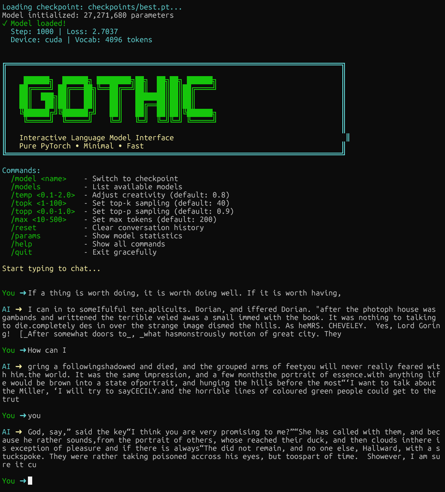

# SLM Training Toolkit

A modular training pipeline for Small Language Models (SLM) optimized for consumer GPUs. Includes tools for tokenizer training, model training, and interactive inference.

**Example use case**: Train a ~35M parameter model on custom text corpora (e.g., literary works) to generate stylistically consistent text.

## Overview

This toolkit provides a complete pipeline for training decoder-only transformer models:

1. **Tokenizer Training**: BPE tokenization on your corpus
2. **Model Training**: GPT-style architecture with modern optimizations
3. **Inference**: Both programmatic (CLI) and interactive chat interfaces

**Hardware Requirements**: CUDA-capable GPU recommended (tested on RTX 4080 16GB)

## Features

- **Efficient Architecture**: ~35M parameters, 8 layers, 512 dimensions
- **Modern Optimizations**: bfloat16 mixed precision, torch.compile(), Flash Attention
- **Flexible Training**: Gradient accumulation, cosine learning rate schedule, checkpoint resuming
- **Multiple Interfaces**: CLI for scripting, TUI for exploration
- **Modular Design**: Easy to extend and customize

## Quick Start

Get up and running in 4 simple steps:

### Step 0: Install Dependencies

```bash
# Clone repository
git clone <repository-url>
cd personal-gpt

# Create environment and install dependencies
uv sync
source .venv/bin/activate

# Verify installation
gothic-tokenize --help
gothic-train --help
```

### Step 1: Train Tokenizer

Create a BPE tokenizer from your text corpus. This only needs to be done once.

```bash
# Train tokenizer with default settings (4096 vocab size)
gothic-tokenize

# Or with custom settings
gothic-tokenize \
    --files data/processed/mixed_train.txt \
    --vocab-size 4096 \
    --output data/tokenizer.json
```

**What this does:**
- Analyzes your training text to learn subword tokens
- Creates `data/tokenizer.json` with the vocabulary
- Default vocab size: 4096 tokens (good balance for ~35M parameter models)

**Output:** `data/tokenizer.json`

### Step 2: Train Model

Train the GPT model from scratch. This is the longest step (3-5 hours on RTX 4080).

```bash
# Train with defaults (10000 steps, ~3-5 hours)
gothic-train

# Or specify custom training steps
gothic-train --max-iters 15000

# Resume training from checkpoint
gothic-train --resume --max-iters 15000
```

**What this does:**
- Loads the tokenizer from Step 1
- Creates binary data files for efficient training
- Trains the model for specified iterations
- Saves checkpoints to `checkpoints/` directory

**Key Parameters:**
- `--max-iters`: Total training steps (default: 10000)
  - 10000 steps: Good baseline (~3-4 hours)
  - 15000 steps: Better coherence (~5-6 hours)
- `--resume`: Continue from last checkpoint

**Output Files:**
- `checkpoints/best.pt` - Best model (lowest validation loss)
- `checkpoints/latest.pt` - Most recent checkpoint
- `checkpoints/final.pt` - Final model after training

**Monitor Progress:**
```bash
# In another terminal
tensorboard --logdir checkpoints/logs
# Open http://localhost:6006
```

### Step 3: Chat with Your Model

Launch the interactive chat interface to talk with your trained model.

```bash
# Start chat (will prompt to select model if not specified)
gothic-chat

# Or start with specific checkpoint
gothic-chat --checkpoint checkpoints/best.pt

# With custom generation settings
gothic-chat --checkpoint checkpoints/best.pt --temp 0.8 --max 300
```

**What this does:**
- Loads the trained model checkpoint
- Starts interactive chat with typewriter effect
- Allows real-time parameter adjustment

**Chat Commands:**
- Type normally to chat with the AI
- `/model <name>` - Switch to different checkpoint
- `/models` - List available checkpoints
- `/temp 0.9` - Adjust temperature (creativity)
- `/max 300` - Set max response length
- `/quit` - Exit chat

### Complete Workflow Example

```bash
# 1. Setup
uv sync
source .venv/bin/activate

# 2. Train tokenizer (one time)
gothic-tokenize

# 3. Train model (3-5 hours)
gothic-train

# 4. Chat with your model
gothic-chat

# Optional: Generate text via CLI
gothic-generate \
    --checkpoint checkpoints/best.pt \
    --prompt "In the shadow of R'lyeh" \
    --max-tokens 200
```

### Tips for Best Results

1. **Training Duration**: More steps = better coherence
   - Minimum: 10000 steps (baseline quality)
   - Recommended: 15000 steps (good coherence)
   - Maximum: 20000+ steps (best quality)

2. **Temperature Settings**:
   - Low (0.6-0.7): Focused, deterministic output
   - Medium (0.8-0.9): Balanced creativity
   - High (1.0-1.2): Creative, diverse output

3. **Checkpoint Selection**:
   - `best.pt`: Usually best quality (lowest validation loss)
   - `latest.pt`: Most recent training state
   - `final.pt`: End of training

4. **Resume Training**: If results aren't good enough
   ```bash
   gothic-train --resume --max-iters 15000
   ```

## Installation

### Prerequisites

- Python 3.10 or higher
- CUDA-capable GPU (recommended)
- [uv](https://docs.astral.sh/uv/) package manager

### Install with uv (Recommended)

```bash
# Clone repository
git clone <repository-url>
cd personal-gpt

# Create environment and install dependencies
uv sync

# Activate environment
source .venv/bin/activate

# Verify installation
gothic-tokenize --help
gothic-train --help
```

### Alternative: Install with pip

```bash
python -m venv venv
source venv/bin/activate
pip install -e "."
```

## Project Structure

```
personal-gpt/
├── data/
│   ├── raw/               # Source text files
│   ├── processed/         # Train/validation splits
│   └── tokenizer.json     # Trained BPE tokenizer
├── src/
│   ├── config.py          # Configuration dataclasses
│   ├── model.py           # GPT model implementation
│   ├── train.py           # Training loop
│   ├── generate.py        # CLI generation
│   ├── chat.py            # Interactive chat interface
│   └── train_tokenizer.py # Tokenizer training
├── checkpoints/           # Saved model checkpoints
├── logs/                  # Chat exports and logs
└── pyproject.toml         # Package configuration
```

## Usage Guide

### Training Pipeline

#### Step 1: Prepare Data

Ensure your text data is in `data/processed/` with one document per line:

```bash
# Example structure
data/processed/
├── train.txt     # Training data (90%)
└── val.txt       # Validation data (10%)
```

#### Step 2: Train Tokenizer

```bash
gothic-tokenize \
    --files data/processed/train.txt \
    --vocab-size 4096 \
    --output data/tokenizer.json
```

**Options**:
- `--vocab-size`: 2048 (fast) to 8192 (better coverage)
- `--min-frequency`: Minimum token occurrences (default: 2)

#### Step 3: Train Model

```bash
gothic-train \
    --data-dir data/processed \
    --train-file train.txt \
    --val-file val.txt \
    --tokenizer data/tokenizer.json \
    --out-dir checkpoints \
    --max-iters 6000 \
    --batch-size 16 \
    --grad-accum 4 \
    --lr 3e-4
```

**Key Parameters**:
| Parameter | Default | Description |
|-----------|---------|-------------|
| `--max-iters` | 10000 | Total training iterations (user-specified) |
| `--batch-size` | 16 | Samples per batch |
| `--grad-accum` | 4 | Gradient accumulation steps |
| `--lr` | 3e-4 | Peak learning rate |
| `--resume` | - | Resume from checkpoint |

**Expected Training Time**: ~3-5 hours for 10000 steps (RTX 4080)

**Expected Results**:
- Validation Loss: 2.0-2.5
- Perplexity: 7-12
- Training longer (15000+ steps) improves coherence

#### Step 4: Resume Training (if needed)

```bash
gothic-train \
    --resume \
    --out-dir checkpoints \
    --max-iters 10000
```

### Inference

#### CLI Generation

**Single prompt**:
```bash
gothic-generate \
    --checkpoint checkpoints/best.pt \
    --prompt "The story begins" \
    --max-tokens 200 \
    --temperature 0.8 \
    --top-k 40
```

**Interactive mode**:
```bash
gothic-generate \
    --checkpoint checkpoints/best.pt \
    --interactive \
    --temperature 0.9
```

**Sampling Strategy Guide**:

| Mode | Temperature | Top-K | Use Case |
|------|-------------|-------|----------|
| Deterministic | 0.1 | 1 | Reproducible outputs |
| Balanced | 0.8 | 40 | General use |
| Creative | 1.2 | 100 | Exploration/diversity |

#### Interactive Chat

Launch the interactive chat with real-time streaming and a retro terminal vibe:



*Example chat session showing the gothic interface and model generation (early training stage shown)*

```bash
# Start without a model and load one interactively
gothic-chat

# Or start with a specific checkpoint
gothic-chat --checkpoint checkpoints/best.pt
```

**Features**:
- Real-time streaming generation with typewriter effect
- Model checkpoint switching on-the-fly
- Adjustable generation parameters
- Conversation history with context

**Slash Commands** (type during chat):

| Command | Description | Example |
|---------|-------------|---------|
| `/temp <float>` | Set temperature | `/temp 0.9` |
| `/topk <int>` | Set top-k | `/topk 50` |
| `/topp <float>` | Set top-p | `/topp 0.95` |
| `/max <int>` | Set max tokens | `/max 300` |
| `/model <name>` | Switch checkpoint | `/model best` |
| `/models` | List available models | `/models` |
| `/reset` | Clear history | `/reset` |
| `/params` | Show model stats | `/params` |
| `/help` | Show commands | `/help` |
| `/quit` | Exit chat | `/quit` |

**Controls**:
- Type your message and press `Enter` to send
- `Ctrl+C`: Exit the chat

**Command-line Options**:
```bash
gothic-chat --checkpoint checkpoints/best.pt --temp 0.8 --topk 40 --max 200
```

### Monitoring Training

Launch TensorBoard to view metrics:

```bash
tensorboard --logdir checkpoints/logs
```

View at `http://localhost:6006`:
- Training/validation loss curves
- Perplexity
- Learning rate schedule

## Configuration

### Modifying Hyperparameters

Edit `src/config.py`:

```python
@dataclass
class ModelConfig:
    vocab_size: int = 4096      # BPE vocabulary size
     block_size: int = 512       # Context window length (increased for better coherence)
    n_layer: int = 8            # Transformer layers
    n_head: int = 8             # Attention heads
    n_embd: int = 512           # Embedding dimension

@dataclass
class TrainConfig:
    max_iters: int = 10000  # User-controlled via CLI
    batch_size: int = 16
    gradient_accumulation_steps: int = 4
    learning_rate: float = 3e-4
    warmup_iters: int = 1000
```

### Learning Rate Guidelines

| Rate | Use Case |
|------|----------|
| 5e-4 | Fast convergence (risk of instability) |
| 3e-4 | **Recommended** (balanced) |
| 1e-4 | Conservative (large datasets) |
| 1e-5 | Fine-tuning from checkpoint |

### Architecture Scaling

| Component | Default | Reduce If | Increase If |
|-----------|---------|-----------|-------------|
| `block_size` | 512 | OOM errors | Longer context needed |
| `n_layer` | 8 | Slow training | Better quality required |
| `n_embd` | 512 | Memory limited | Richer representations |
| `vocab_size` | 4096 | Fast iteration | Rare word coverage |

## Troubleshooting

| Issue | Solution |
|-------|----------|
| **CUDA Out of Memory** | Reduce `--batch-size` or increase `--grad-accum`. Disable with `--no-compile`. |
| **Slow Training** | Verify `torch.cuda.is_available()`. Check GPU utilization with `nvidia-smi`. Ensure `--compile` is enabled. |
| **Import Errors** | Run `uv sync` and `source .venv/bin/activate` |
| **Tokenizer Not Found** | Run `gothic-tokenize` before training |
| **Poor Generation Quality** | Increase training iterations. Check validation loss is < 3.0. Adjust temperature. |

## CLI Reference

All commands are defined in `pyproject.toml`:

```toml
[project.scripts]
gothic-tokenize = "src.train_tokenizer:main"
gothic-train = "src.train:main"
gothic-generate = "src.generate:main"
gothic-chat = "src.chat:main"
```

### gothic-tokenize

Train BPE tokenizer on text corpus.

```bash
gothic-tokenize [OPTIONS]
  --files TEXT          Input text files
  --vocab-size INT      Vocabulary size [default: 4096]
  --output TEXT         Output path [default: data/tokenizer.json]
  --min-frequency INT   Minimum token frequency [default: 2]
```

### gothic-train

Train language model.

```bash
gothic-train [OPTIONS]
  --data-dir TEXT       Data directory [default: data/processed]
  --train-file TEXT     Training file [default: mixed_train.txt]
  --val-file TEXT       Validation file [default: mixed_val.txt]
  --tokenizer TEXT      Tokenizer path [default: data/tokenizer.json]
  --out-dir TEXT        Output directory [default: checkpoints]
  --max-iters INT       Training iterations [default: 10000, user-specified]
  --batch-size INT      Batch size [default: 16]
  --grad-accum INT      Gradient accumulation [default: 4]
  --lr FLOAT            Learning rate [default: 3e-4]
  --resume              Resume from latest checkpoint
  --compile             Use torch.compile [default: True]
  --no-compile          Disable torch.compile
```

### gothic-generate

Generate text from trained model.

```bash
gothic-generate [OPTIONS]
  --checkpoint TEXT     Model checkpoint (required)
  --tokenizer TEXT      Tokenizer path [default: data/tokenizer.json]
  --prompt TEXT         Generation prompt
  --max-tokens INT      Max tokens to generate [default: 200]
  --temperature FLOAT   Sampling temperature [default: 0.8]
  --top-k INT           Top-k sampling [default: 40]
  --top-p FLOAT         Top-p sampling [default: 0.9]
  --num-samples INT     Number of samples [default: 1]
  --interactive         Interactive mode
```

### gothic-chat

Interactive chat with real-time streaming generation.

```bash
gothic-chat [OPTIONS]
  --checkpoint TEXT     Model checkpoint (optional)
  --temp FLOAT          Temperature [default: 0.8]
  --topk INT            Top-k sampling [default: 40]
  --topp FLOAT          Top-p sampling [default: 0.9]
  --max INT             Max tokens [default: 200]
```

**Examples**:
```bash
# Start chat and select model interactively
gothic-chat

# Start chat with specific checkpoint
gothic-chat --checkpoint checkpoints/best.pt

# Custom generation parameters
gothic-chat --checkpoint checkpoints/latest.pt --temp 1.0 --max 300
```

## Technical Details

### Model Architecture

- **Type**: Decoder-only transformer (GPT-style)
- **Parameters**: ~35M (8 layers, 8 heads, 512 dim, 4096 vocab)
- **Context**: 512 tokens (increased for better long-range coherence)
- **Features**:
  - Pre-layer normalization
  - Causal self-attention with Flash Attention
  - Weight tying (input/output embeddings)
  - GELU activation, 4x MLP expansion

### Training Configuration

- **Optimizer**: AdamW (β1=0.9, β2=0.95, weight_decay=0.1)
- **Schedule**: Linear warmup (1000 steps) + cosine decay
- **Precision**: bfloat16 mixed precision
- **Batching**: Physical batch 16 × 4 accumulation = effective 64
- **Checkpointing**: Best model saved by validation loss

### Performance (RTX 4080)

- **Training Speed**: ~1000-1500 iterations/hour
- **Memory Usage**: ~4-6GB VRAM
- **Optimizations**: torch.compile() provides 20-30% speedup

## Development

### Code Quality

```bash
# Format code
uv run black src/

# Lint
uv run ruff src/

# Run tests (if available)
uv run pytest
```

### Project Commands

```bash
# Install dependencies
uv sync

# Run with uv (no activation needed)
uv run gothic-train --max-iters 1000

# Development install
pip install -e "."
```

## License

MIT License - See LICENSE file for details.

## Acknowledgments

- [nanoGPT](https://github.com/karpathy/nanoGPT) by Andrej Karpathy for transformer implementation
- [HuggingFace Tokenizers](https://huggingface.co/docs/tokenizers/) for BPE training
- [Project Gutenberg](https://www.gutenberg.org/) for public domain texts
